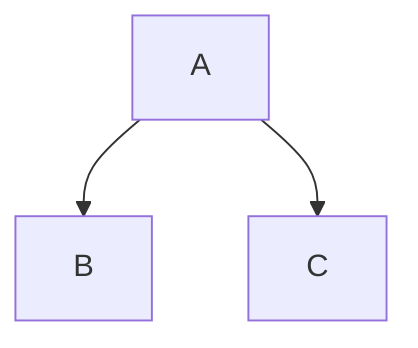

 Learning GIT and GITHUB by Tharun
 =
 Hello I am  Sai Tharun!
 --
Hello I am  **Sai Tharun** ~~and~~ I like _yellow_
***
This is a footnote[^1]. Another footnote[^2].
>No Pain No Gain
- Item One
- Item Two

1. Item One
2. Item Two
   - Indented
   - ANother One
     * Another one
[This](https://github.com/NMSaiTharun/stunning-lamp/edit/main/README.md) is the Readme url
https://github.com/NMSaiTharun/stunning-lamp/edit/main/README.md

[](https://github.com/NMSaiTharun/stunning-lamp/edit/main/README.md)

| Left | Center | Right  |
|----- | :-----:| ----:  |
| One  | Two    | $1.00  |
| Three| Four   | $120.00|
| Five | Six    | $121.00|

- [x] First
  - [x] One
  - [ ] Two
- [ ] Second

💛
> [!NOTE]
>  A Note

> [!IMPORTANT]
> Important

>[!WARNING]
> Warning



<details>
  <summary> Collapsed  </summary>
  # Header
  This is a copy of the collapsed text.
</details>

[^1]: FootnoteOne Reference
[^2]: FootnoteTwo Reference


```js
x=console.log("Hello");
```
```cs
s=Console.WriteLine("Hello");
```
